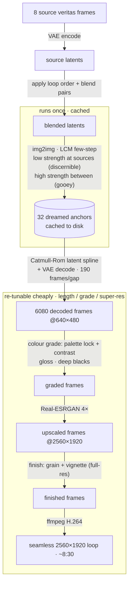

# Vanitas / Veritas — a dream-like slop loop

An endless, slow, gooey video loop that melts eight vanitas portraits into one
another and back again — faces and skulls dissolving into clustered soap bubbles
and sprays of gold, sometimes recognizable, sometimes lost. Built entirely with
open-source diffusion models, rendered locally on an Apple M5.

> **Note for the submission writer (Cowork):** this README is the source of
> truth for the *how* and the *why*. Pull freely from any section. Technical
> specs for a caption/colophon are in **§7**. The conceptual framing for body
> copy is in **§2** and **§6**. The making-of narrative is in **§5**.

---

## 1. The artifact

- **Form:** a single seamless video loop, designed to play on repeat
  indefinitely (gallery / installation context).
- **Final render:** `video/veritas_loop_v45_4k.mp4` — ~8 min 30 s, **2560×1920**
  (Real-ESRGAN 4× super-res), 12 fps, H.264.
  *(Earlier 1080p cut `video/veritas_final_v44.mp4`, ~2:50, kept as a fallback.)*
- **Loop:** mathematically seamless — the last frame eases back into the first,
  so there is no visible cut or "reset." Watched long enough, the loop point
  dissolves and it reads as endless.
- **Source:** eight AI-generated vanitas frames (`source/veritas/`), 2544×1904, 4:3.

---

## 2. Concept

**Vanitas** is the classical still-life genre of *memento mori* — skulls, guttering
candles, and **soap bubbles** as emblems of the fragility and transience of life
(*homo bulla*, "man is a bubble"). This piece takes that vocabulary and runs it
through the dream-logic of a diffusion model: a face becomes a skull becomes a
swelling bubble that you worry might pop, becomes gold dust, becomes a face
again. Nothing holds its form; everything is mid-dissolve.

The title pun — **Vanitas / Veritas** (vanity / truth) — frames the loop as a
meditation: the "truth" underneath the vanity is that all of it is in flux, a
slow churn of becoming and un-becoming. The aesthetic is deliberately **"slop"**
— the gooey, melty, half-hallucinated texture native to generative models — but
treated with restraint and luxury so it reads as intentional and beautiful
rather than accidental.

**Intended viewing:** ambient and meditative — something you can watch for
minutes at a time, getting lost in.

### Art-directed feeling (the words that drove the final look)
liquid · gooey · clear (not hazy) · endless · lost · *slooow building bubble you
worry might pop* · luxury · simultaneously clean and dirty.

---

## 3. Source material

Eight vanitas portraits generated in **Midjourney** (`source/veritas/*.png`),
sharing a tight visual language that makes them ideal for morphing — faces and
skull-profiles dissolving into particles, the white flower/bloom frames, and a
*daisy-skull-bubble* frame that holds the whole vanitas trinity (flower + skull +
bubble) in a single image:

- a central face or skull on a deep black ground;
- the figure dissolving into **beaded particles, soap bubbles, and foam**;
- sprays and flecks of **gold** light;
- a luminous, near-monochrome palette with warm gold accents.

Because every frame is *already* a portrait caught mid-dissolution, the
transitions between them feel native rather than forced — the morph is just
continuing a dissolution the source images began.

---

## 4. How it works — "Dreamed Anchors + Smooth Drift"

The core engine (`code/morph_v44.py`) is built around one idea: **decouple what
the loop looks like from how it moves.**

Naive approaches (re-dreaming every single frame, or warping pixels with a
displacement field) fail in characteristic ways — independent per-frame
diffusion makes fine detail *boil/flicker* (reads as frantic), and periodic
displacement fields read as literal *waves/water*. Both were tried and rejected.

The final architecture instead does this:

1. **Dream a sparse ring of "anchor" frames.** Around the loop, at evenly spaced
   points, a Stable Diffusion **img2img** pass re-imagines a blended source
   image into the target style. Anchors *at* the original source positions are
   only lightly dreamed (so the source remains **discernible**); anchors
   *between* sources are dreamed harder (so they become **gooey, abstract,
   weird**). This rhythm produces the "sometimes recognizable, sometimes lost"
   quality. Anchors are encoded to latent space and **cached** to disk
   (`code/anchors_final.pt`).

2. **Interpolate, don't re-dream.** Between consecutive anchors, the latent
   vectors are blended along a **Catmull-Rom spline** (a smooth curve that
   passes *through* each anchor without stopping or kinking) and simply
   **decoded**. Decoding is deterministic, so the motion is **glassy-smooth with
   zero flicker**, and it is cheap (~1 s/frame) — which means many slow frames
   can be packed between anchors. Slowness and length are free.

3. **Grade, don't warp.** A light color/finish pass (no geometric distortion at
   all) gives the final look: a faint dream-softness, a glossy specular bloom
   (wet luxury sheen), deepened blacks, a **palette lock** (cool monochrome base
   with goldish-orange accents isolated to the regions that were warm in the
   source), fine film grain, and a grime vignette. This is where **clear +
   luxurious + "clean and dirty"** come from.

Because the expensive diffusion only happens on ~32 cached anchors, the loop's
length, slowness, resolution, and grade can all be re-tuned by re-running only
the cheap decode+grade stage.

### Pipeline at a glance



*The expensive diffusion happens only on the 32 cached anchors; loop length,
slowness, and grade are all re-tuned by re-running just the cheap decode+grade
stage.*

---

## 5. Process / evolution (the making-of)

The piece went through a deliberate, feedback-driven iteration:

1. **v1 — per-frame melt.** Latent SLERP between the 8 frames with a per-frame
   img2img "re-dream" peaking at each transition midpoint. Beautiful stills, but
   it (a) *paused* on each keyframe (an easing artifact) and (b) boiled/flickered.
2. **Never-still pass.** Replaced the easing with a Catmull-Rom spline through
   the latents so motion never stops — important because, in the intended
   installation, the *only* still moment is a physical pause.
3. **Liquify experiments.** A post-process displacement field was tried for
   "liquid" — but periodic waves read as *ocean/puddle*. Rejected. Key
   correction: the desired texture is **bubbly** (rounded, soap-film, foam), not
   **wavy**. No displacement warps in the final.
4. **Grid search on style.** A 3×3 sweep (prompt family × img2img strength)
   established that strength **~0.6** is the gooey sweet spot — higher (~0.78)
   resolves into crisp marble busts/skulls (too hard), lower (~0.45) barely
   departs from the source.
5. **v3 — "Dreamed Anchors."** The architecture above; solved the flicker and
   the waviness in one move (smoothness now comes from *interpolation*, not
   warping).
6. **v4 — final grade + direction.** Tuned to the art-direction words in §2:
   removed the hazy fog, deepened the blacks for luxury, added gloss + gold +
   grain + grime ("clean and dirty"), pushed the prompt toward liquid, swelling,
   about-to-pop bubbles, then slowed and lengthened the loop for the meditative,
   endless, "lost" feeling.
7. **v4.4 — final tuning.** Slowed further (M=64) and made the transitions *more
   uncanny* by densifying and intensifying the dreamed waypoints (D=4, strength
   to 0.70) — leaning into emergent hallucination rather than literal morphing.
   Added a **palette lock** to preserve the source's signature colour — a cool
   monochrome base with gold-orange accents — so the diffusion can't drift it.
   Settled here: the speed reads as "uncanny valley," the palette is intact.
8. **Loop ordering.** One source frame was swapped for a new
   *daisy-skull-bubble* image (the literal vanitas trinity — flower + skull +
   bubble in one). The **order** the eight frames cycle in is its own artistic
   variable: it sets the loop's flow, arc, and surprise. Two tools made this
   fast to iterate:
   - a **perceptual distance matrix** (downscaled, blurred luminance + a warm/gold
     map) over the eight frames, with a brute-force search for the smoothest
     Hamiltonian *cycle* — an objective measure of how seamless an ordering is;
   - a **fast preview harness** (`code/order_preview.py`) that morphs the *real*
     frames via VAE latent spline (no diffusion) at low res — ~1 min per candidate
     vs ~50 min for a full render — because the gooey look is identical across
     orderings; only the sequence changes.

   Three philosophies were compared — *smoothest* (pure minimal-jump), *vanitas
   narrative* (life → dissolution → death → bloom), and *bloom-climax* (the three
   flower frames clustered as a crescendo) — then **combined by constrained
   optimisation**: solve for the smoothest order that is *required* to keep the
   narrative spine (skull → trinity-pivot → blooms) and the bloom cluster. The
   result has a deliberate dramatic shape — a calm, flowing opening that builds to
   a surprising bloom crescendo, then resets — rather than uniform smoothness.
9. **Harmonization.** Two **self-portraits** (a photographic "real" selfie and an
   AI-styled "mirror" one) were brought into the body of work — as **stills, not
   loop frames**. The moving loop stays the **eight veritas frames**; the
   self-portraits live alongside it as harmonized submission imagery (the artist
   present at the edges of the work, not inside the dream). A single grade
   (`code/harmonize.py`) unifies the whole set — luminance → cool monochrome base,
   gold-orange re-introduced only where the source was warm, plus a contrast
   S-curve — so the warm photographic selfie now sits in the same palette and
   punch as the veritas frames. Full-res harmonized versions live in
   `source/harmonized/`, and the render pipeline's grade was aligned to the same
   constants so the moving loop matches the harmonized stills.
10. **Max-quality super-res (final).** The loop was slowed 3× more (M=190 →
    **6,080 frames, ~8:30**) and every frame run through **Real-ESRGAN 4×**
    (`code/morph_v45_sr.py`, spandrel + `RealESRGAN_x4plus`, fp16) for a native
    **2560×1920** output — far cleaner than a lanczos upscale. The colour grade
    is applied *before* super-res and the **grain + vignette are re-added after**,
    at full resolution, so the "clean and dirty" texture survives the upscale
    instead of being smoothed away. The expensive anchors are reused from cache;
    only the decode + super-res stage re-runs (~6 hr overnight render).

---

## 6. Style notes

- **Palette:** a strict, locked profile — a **cool silver monochrome base** over
  deep velvety black, with **goldish-orange accents** isolated only to the regions
  that were warm in the source (the gold sprays and flecks). The diffusion cannot
  drift the colour; the white forms stay cool-white, the gold stays gold. Jewel-like,
  opulent, restrained.
- **Texture:** "clean and dirty" — crisp, glossy, well-defined forms wearing a
  layer of fine grain and a grimy edge vignette. Pristine and decaying at once,
  which is itself a vanitas idea.
- **Motion:** very slow, continuous, smooth. Forms swell and ooze and dissolve;
  bubbles build with a faint tension. No stutter, no waves.
- **Legibility:** rhythmically in and out — a face or skull surfaces clearly,
  then loses itself in gooey abstraction, then re-forms.

---

## 7. Technical specifications (for caption / colophon)

| | |
|---|---|
| **Models (open-source)** | Stable Diffusion v1.5 + LCM-LoRA (`latent-consistency/lcm-lora-sdv1-5`); Real-ESRGAN x4plus (super-res) |
| **Frameworks** | 🤗 Diffusers, PyTorch (MPS), spandrel, scipy/PIL/NumPy, ffmpeg |
| **Hardware** | Apple M5, 16 GB, fully local (no cloud compute) |
| **Sampler** | LCMScheduler, 8 steps, guidance 1.5, fp32 |
| **Diffusion working resolution** | 640×480 (super-res to 2560×1920) |
| **img2img strength** | 0.42 at source anchors (discernible) → 0.70 between (gooey/uncanny) |
| **Loop order** | `0 → 1 → 4 → 3 → 2 → 7 → 6 → 5` (constrained-optimal: smoothest order keeping the narrative spine + bloom cluster) |
| **Loop structure** | 8 sources × 4 anchors = 32 dreamed anchors; Catmull-Rom interpolation; 190 decoded frames per anchor gap = 6,080 frames |
| **Interpolation** | spherical/Catmull-Rom blend in VAE latent space |
| **Finish** | colour grade (palette lock + contrast S-curve, gloss, deep blacks) → **Real-ESRGAN 4×** → grain + grime vignette (re-added at full res) |
| **Output** | **2560×1920**, 12 fps, ~8 min 30 s, H.264 (seamless loop) |
| **Seed** | 7 (reproducible) |

---

## 8. Folder layout

```
tiat_slop_2026/
├── README.md · README.html        this document
├── documents/                    the submission doc bundle (Submission · Build Guide · Web, self-contained HTML + assets)
├── video/                         the final render + basin loop
├── research/                      vanitas paper, references, ref images
├── source/                        source artwork (veritas frames + harmonized + self-portraits)
├── code/                          the pipeline + the final cached anchors
├── _order_tests/                 fast loop-order preview clips
└── _archive/                      superseded versions, frames, logs (kept, not deleted)
```

### Key files

| Path | Role |
|---|---|
| `documents/Vanitas Veritas - Submission.dc.html` | **the submission** doc (self-contained HTML) |
| `documents/Vanitas Veritas - Build Guide.dc.html` | install / build guide |
| `documents/Vanitas Veritas - Web.dc.html` | web presentation doc |
| `documents/assets/` | images/video the docs embed |
| `video/veritas_final_v44.mp4` | **the final render** (the artwork) |
| `video/Vanitas_Veritas_basin_loop.mp4` | the basin loop variant |
| `source/veritas/` | 8 source vanitas frames (Midjourney) |
| `research/Vanitas_research_paper.pdf` | art-historical paper on the vanitas tradition |
| `research/vanitas_references/` | public-domain reference plates |
| `code/morph_v45_sr.py` | **the final render** — reuses anchors, decodes slow loop, Real-ESRGAN 4× → 2560×1920 |
| `code/morph_v44.py` | the dreamed-anchors engine (dreams + caches the anchors; 1080p path) |
| `code/anchors_final.pt` | cached dreamed anchor latents (the expensive, reusable part) |
| `code/models/RealESRGAN_x4plus.pth` | super-res weights (open-source) |
| `code/morph_v3.py` | the v4 engine (earlier grade, superseded by v44) |
| `code/morph_loop.py` | the earliest per-frame engine (superseded; kept for history) |
| `code/order_preview.py` | **fast loop-order iteration** — VAE-only morph proxy (~1 min/candidate) |
| `code/harmonize.py` | **palette/warmth/contrast harmonizer** — unifies the veritas frames + self-portraits |
| `source/harmonized/` | full-res harmonized versions of the whole set (cohesive grade) |
| `source/IMG_6975.jpeg` · `source/…wash_your_hands…png` | the **self-portraits** (real + mirror) |
| `code/dream_test.py` | the 3×3 style grid-search harness |
| `code/liquify.py` | the rejected displacement experiment (kept for history) |
| `code/dream_styles_grid.png` | the grid-search result image (itself a nice artifact) |
| `_archive/` | old renders (v1–v4.4), frame dumps, logs, superseded checkpoints |

---

## 9. Reproducing it

```bash
pip install --user diffusers transformers accelerate safetensors \
                   peft imageio imageio-ffmpeg scipy pillow
python3 code/morph_v44.py --fresh   # dream anchors + render (omit --fresh to reuse cache)
```

Tunable knobs at the top of `morph_v44.py`: `D` (anchor density / uniqueness),
`M` (frames per gap → loop length & slowness), `LOW_STR`/`HIGH_STR`
(discernible↔gooey), `SUBSET` (render a 2-frame test instead of all 8), the
prompt, and the grade constants — `GLOSS_W`, `BLACK_GAMMA`, and the palette lock
(`COOL`, `GOLD_TONE`, `WARM_SCALE`), `GRAIN`, `VIG_STR`.
